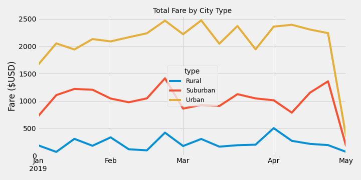
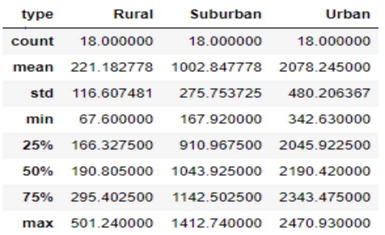

# PyBer_Analysis_Challenge

## Analysis Overview

### Purpose
The purpose of this analysis is to provide insights that will allow for actions that will improve access and affordability for underserved neighborhoods.

### Overview
This analysis looks at drivers, number of rides, number of drivers, average fare by ride, and average fare by driver. The data is also segregated by city type. These are rural, suburban and urban city types.

### How the Analysis was Conducted
#### Data
This analysis was conducted based off the data provided in two files. The first file is the [city_data.csv](Resources/city_data.csv) file which shows the city, the driver count for each city and the city type.
The second file is the [ride_data.csv](Resources/ride_data.csv) file which shows the city, date of the ride, the fare for that ride and the ride ID. Both files span the period from 1 Jan 2019 through 5 May 2019. Note the range of analysis is from 1 Jan 2019 through 29 April 2019.

#### Steps Conducted
1. After some plotting practice the files were reviewed to make sure the data did not need to be cleaned, which it did not, both files were merged on city to get a combined view data frame.
2. Using Pandas, the data was broken out into city type. The the number of rides per the city types was summed up, the driver count per city type and the fares per city type were
summed. Based on that information the average fare per ride and average fare per rider was calculated.  
3. Using this information the data was pivoted and the dates were set as the index and aggregated to a weekly basis in preparation to create a graph. A line chart raph was created that shows the fare amounts over the time frame by city type.
#### Tools used
Python was used within the Jupyter development environment. The Pandas, Matplotlib.pyplot and Matplotlib styles are libraries that were used to take advantage of data framing
 and data manipulation (the Pandas library), and to create various graphics using the tools available in the Matpolotlib.pyplot library and styles functionality.  

### Results
The results are based on the below summary statististics and graph.
#### Summary Statistics
In looking at the summary statistics shown in table 1 

Table 1.

1. There is an increasing quanity of total rides, total drivers and and increasing amount in total fares from rural to suburban to urban city types.
2. The highest average fare per ride was for the rural city type as is the average fare per driver. Though the rural total rides were the lowest of all three city types, the average fares per ride and per driver were the highest.
An assumption at this point is that this is due to increased distances in rural areas, though this should be verified.
Looking deeper into this, the rural city type had the largest differnce bewteen average fare per ride and average fare per driver, $20.87. The differences for suburban and urban are $8.53 and $7.96
with the urban city type being the only type to have a higher avergae fare per ride then the average fare per driver. 

#### Total Fare by City Type Graph
Looking at Figure 1,

Figure 1

this graph shows the fares in U.S. dollars for each fare  based on city type per week for the time frame of the data. Looking at it one can see a number of items of interest:
1. The difference in fares follows these summary statistices. Seet Table 2

.

Table 2.

The total urban fares are the largest. the average is $2,078 dollars per week. The suburban average is $1002.8 per week and the rural average fare for the week is $221.
2. The fares for all three city types follow the same pattern thorugh most of March. there is a spike for all three city types in March. After March the variation does not seem correlated until the end of April where all three city types drop.
Additionally the standard deviation for the rural fare by week is 116. Compare this to the standard devitation for the suburban city type, 275.8 and 480 for the urban city type. The rural city type has the lowest standard deviation.

### Summary and Recommendations
Keeping acccess and affordability in mind, the following recommendations and areas of further study are provided.
1. given the largest average fare per driver, and the largest difference between average fare per ride as compared to average fare per driver is in the rural area, we might want to do two things:
 a. conduct further analysis on rural cities to see if this is consistent across all rural cities.
 b. work to increase the number of drivers in the rural area.
Though the rurual city type is the least profitable, this could bring the average fare per ride down as well as increase rides, and hopefully profit, in the steadiest area of the thre.
2. Find out what caused the spike in late February. If this is controllable we could promote this.
3. Further sensitivity analysis to compare driver saturation verses average fare per ride should be conducted to find the maximum quantity of drivers we should target in each of the three city types.

